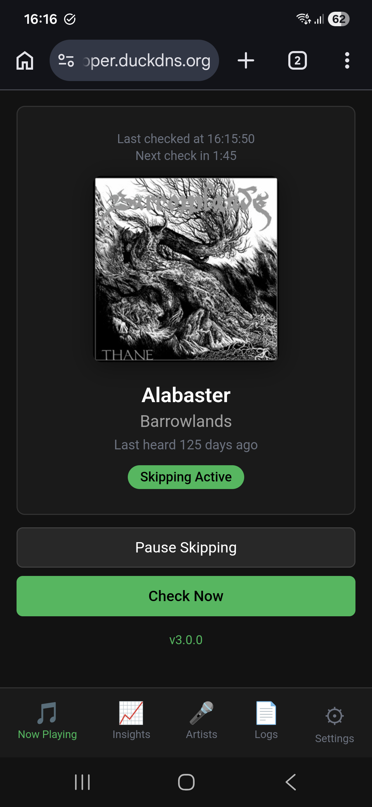
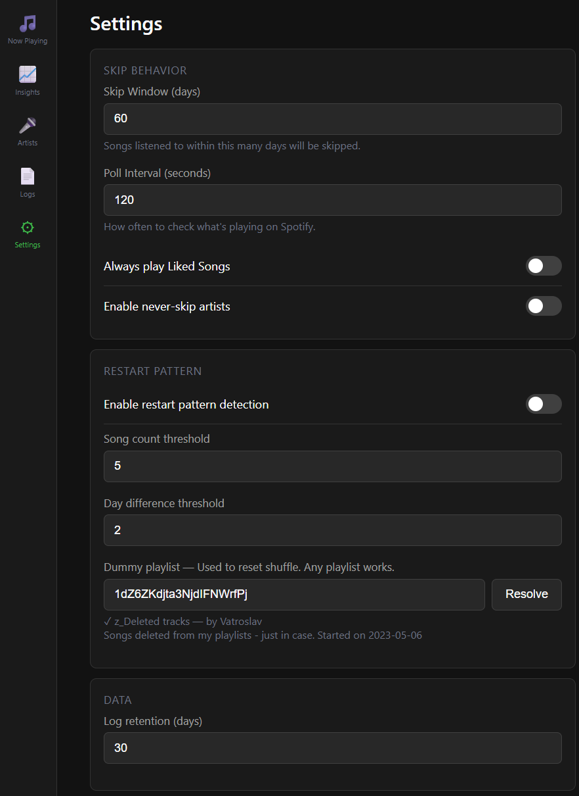
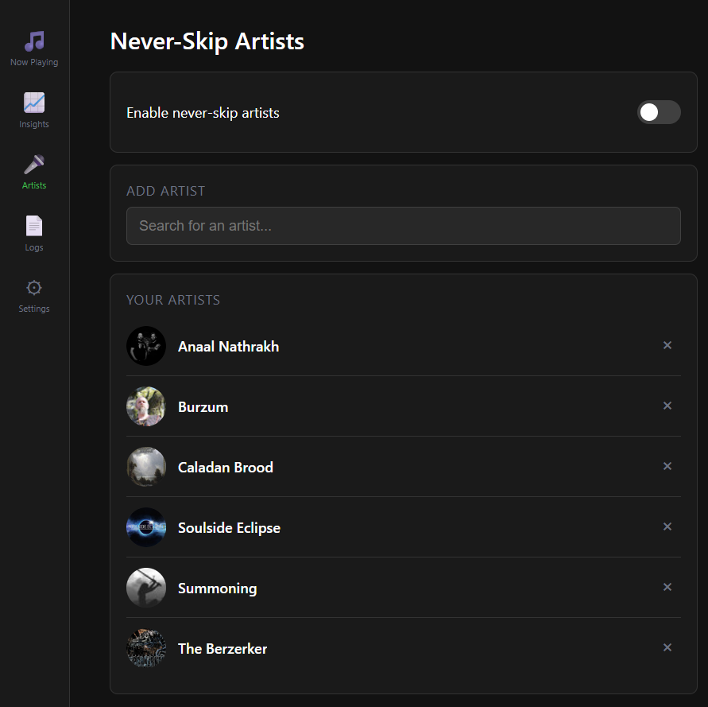
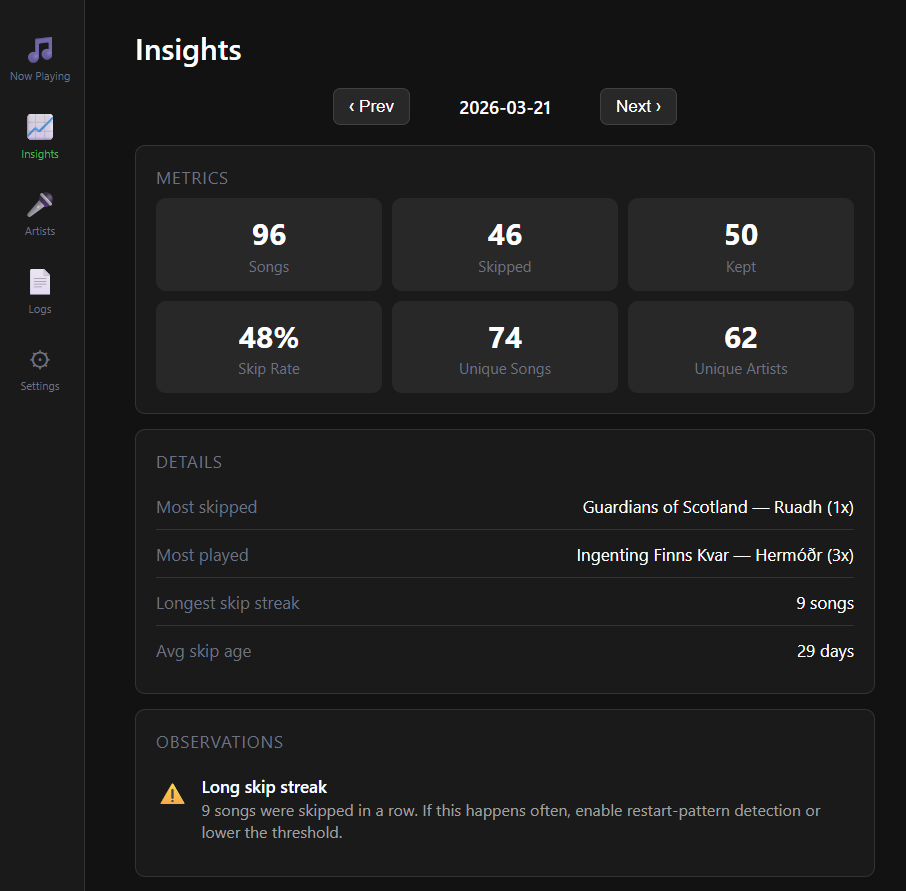
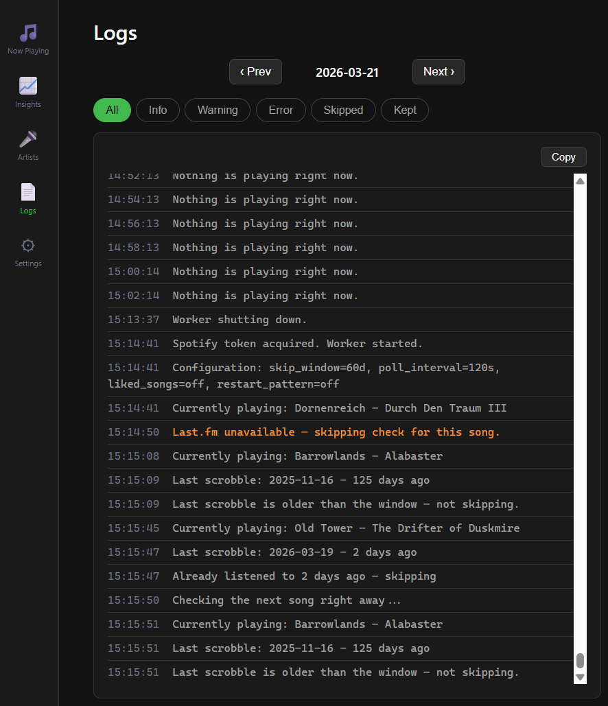
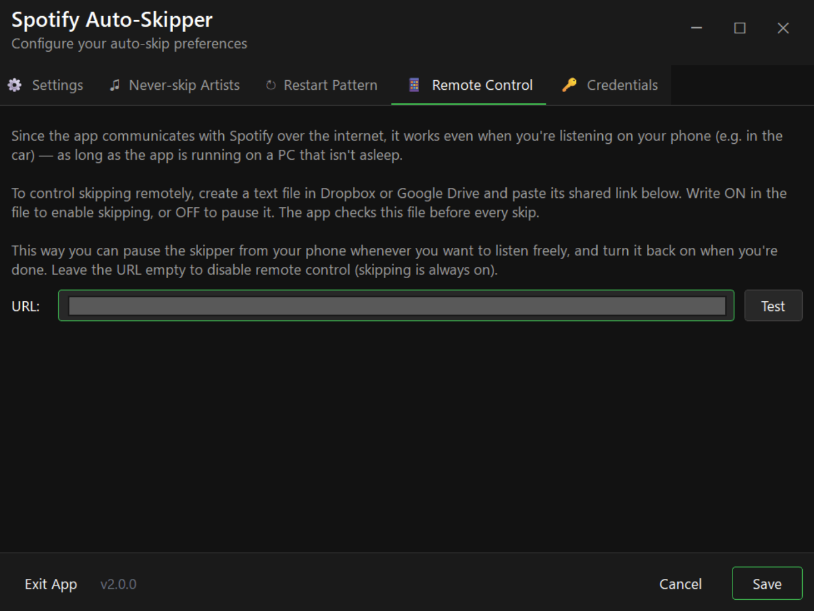
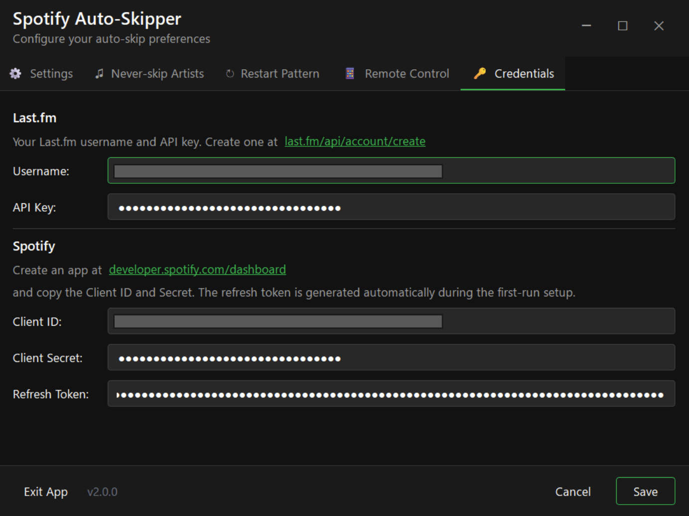

# Spotify + Last.fm Auto-Skipper

I have a [playlist with over 6,000 songs](https://open.spotify.com/playlist/2DTe0ztu8OB5c1B80pjdfc?si=7b1c5cb732394d14), but Spotify's shuffle keeps playing the same ones over and over. This app fixes that — it checks your Last.fm scrobble history and automatically skips any song you've already heard recently, so you actually get to hear the rest of your library.

Available as a **self-hosted cloud app** (v3.10.1) or a legacy **Windows desktop app** (v2.5.0).

---

## Cloud Version (v3.10.1)

A self-hosted web app you can run on any VPS with Docker. Access it from any device via browser — no desktop client needed.

### Screenshots

| Dashboard | Settings | Artists |
|:---:|:---:|:---:|
|  |  |  |

| Insights | Logs |
|:---:|:---:|
|  |  |

### Features

- **Web dashboard** — see what's playing, skip status, and countdown to next check
- **Manual track actions** — remove the current track from its playlist (with optional backup to a trash playlist), like/unlike (synced to Last.fm), or exempt the current song from skipping once
- **Adaptive skip window** — temporarily narrows the skip window after a run of consecutive skips so more songs get through
- **Adaptive polling** — slows down polling when nothing is playing, speeds back up on playback
- **Never-skip artists** — search Spotify and add artists directly from the browser
- **Settings page** — configure skip window, poll interval, liked songs, restart pattern
- **Insights** — daily metrics: songs played, skipped, skip rate, streaks, and more
- **Logs viewer** — filterable log browser with date navigation
- **Browser-based OAuth** — connect Spotify with one click, no manual token copying
- **Docker deployment** — single `docker compose up` with automatic HTTPS via Caddy
- **Security hardened** — CSP headers, encrypted token storage, non-root container, session auth

### Quick start

1. Clone the repo and set up environment:
   ```bash
   cd cloud
   cp .env.example .env
   # Edit .env with your Spotify, Last.fm, and secret key values
   ```

2. Start with Docker Compose:
   ```bash
   docker compose up -d
   ```

3. Visit your server URL and click **Connect Spotify** to authorize.

### Configuration

Secrets are configured via environment variables in `cloud/.env`:

| Variable | Description |
|----------|-------------|
| `SPOTIFY_CLIENT_ID` | From [Spotify Developer Dashboard](https://developer.spotify.com/dashboard) |
| `SPOTIFY_CLIENT_SECRET` | From Spotify Developer Dashboard |
| `LASTFM_USERNAME` | Your Last.fm username |
| `LASTFM_API_KEY` | From [Last.fm API](https://www.last.fm/api/account/create) |
| `SECRET_KEY` | Session signing key (min 32 chars, generate with `python -c "import secrets; print(secrets.token_urlsafe(32))"`) |
| `BASE_URL` | Your server's public HTTPS URL |

All other settings (skip window, poll interval, etc.) are configured through the web UI and stored in SQLite.

### Health monitoring

`GET /health` returns app version and worker status. Returns HTTP 503 when the worker is dead. The Docker image includes a `HEALTHCHECK` that pings this endpoint every 30 seconds.

**Worker self-healing.** The background worker can die two ways, and they are handled differently on purpose:

- **Crash** (unexpected exception escapes the loop, or fails in pre-loop setup): an in-process supervisor (`worker.py::worker_supervisor`, spawned in the lifespan) detects the dead task and restarts it via `restart_worker_if_dead()`, with an exponential backoff cap so a recurring crash doesn't spam logs. Recovery is in seconds, no container bounce.
- **Clean stop** (re-auth / credential needed): the worker returns cleanly and the supervisor leaves it alone — restarting would just re-hit the dead token and loop. This state waits for the user to reconnect at `/auth/login`, which restarts the worker itself. The supervisor distinguishes the two via `task.exception()` (a crash has one; a clean return does not).

**Conscious decision — no container-level autoheal.** `restart: unless-stopped` only reacts to the process exiting, not to an unhealthy status, so a fully wedged process (blocked event loop, dead uvicorn) is NOT auto-recovered — the supervisor runs on the same loop and can't fix that. We deliberately do not add a container autoheal (e.g. willfarrell/autoheal) or an app self-exit: the historical worker deaths have all been either crashes (now self-healed in-process) or re-auth (needs a human anyway), and a naive autoheal would restart-loop the container on the re-auth 503. That tail risk is left as **signal-only**: the Docker HEALTHCHECK still flips the container to unhealthy so it's visible in `docker ps` / the health JSON. Revisit only if a real wedged-process incident occurs.

---

## Desktop Version (v2.5.0) — Legacy

> **Note:** The desktop version is no longer actively developed. The source code has been archived but the [v2.5.0 release](https://github.com/Vatroslav/spotify-auto-skipper/releases/tag/v2.5.0) remains available for download.

A Windows system tray app with a dark Spotify-themed GUI built with PySide6.

### Screenshots

| Settings | Never-skip Artists | Restart Pattern |
|:---:|:---:|:---:|
|  |  |  |

| Remote Control | Credentials |
|:---:|:---:|
|  |  |

### Features

- **Dark Spotify-themed GUI** with setup wizard for first-run configuration
- **System tray integration** — pause skipping, check now, open settings
- **Artist search with images** — search Spotify and add to never-skip list
- **Encrypted credentials** (Fernet) — secrets never stored in plain text
- **Start with Windows** toggle
- **Always play liked songs** option
- **Playlist restart detection** — breaks repeating skip loops
- Logs all activity to daily log files with automatic purge

### Getting started

Download the pre-built EXE from the [v2.5.0 release](https://github.com/Vatroslav/spotify-auto-skipper/releases/tag/v2.5.0) and run it. The Setup Wizard opens on first run and walks you through connecting Last.fm and Spotify.

---

## How it works

Both versions share the same core logic:

1. Poll Spotify API for the currently playing track
2. Look up the track on Last.fm to find when you last scrobbled it
3. If the last scrobble is within your skip window (default 60 days), skip the track
4. Optionally protect liked songs and never-skip artists from being skipped

---

## Credits

Created by [**Vatroslav Mileusnić**](https://www.linkedin.com/in/vatroslavmileusnic) with Claude Code, ChatGPT, Copilot, OpenAI Codex, Figma AI, Canvas AI
