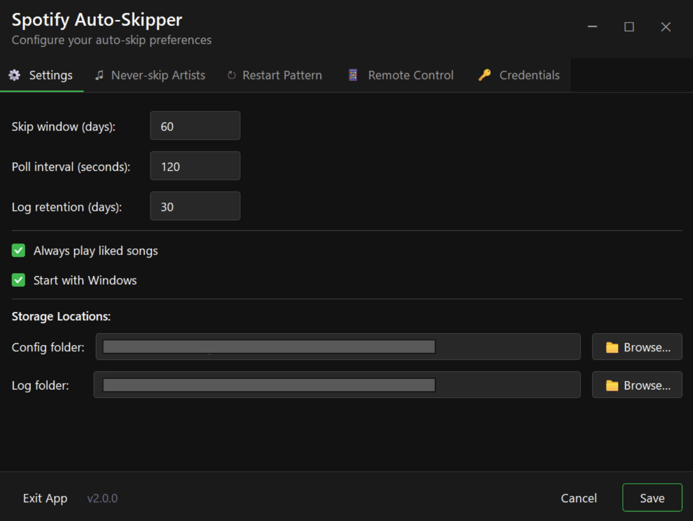
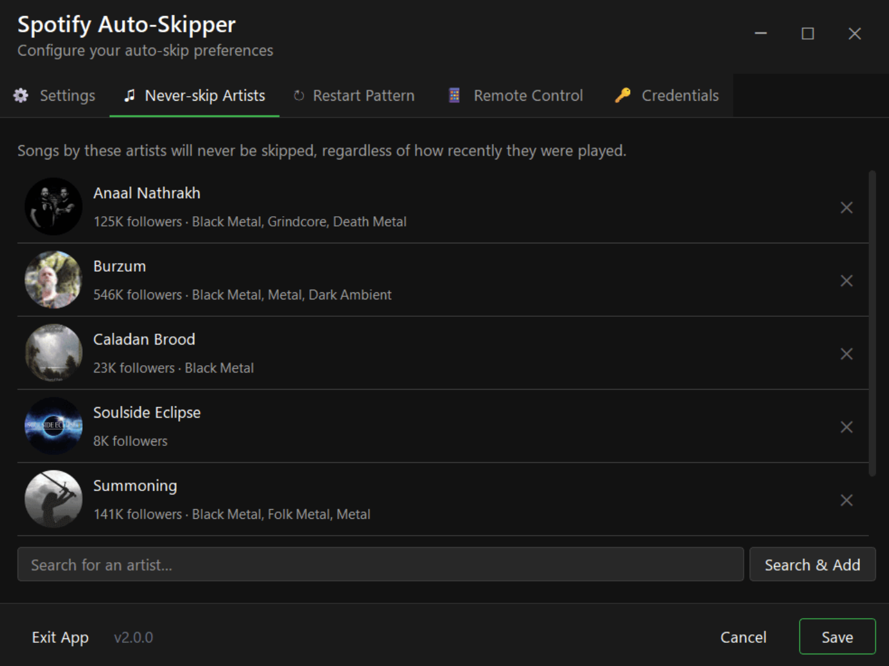
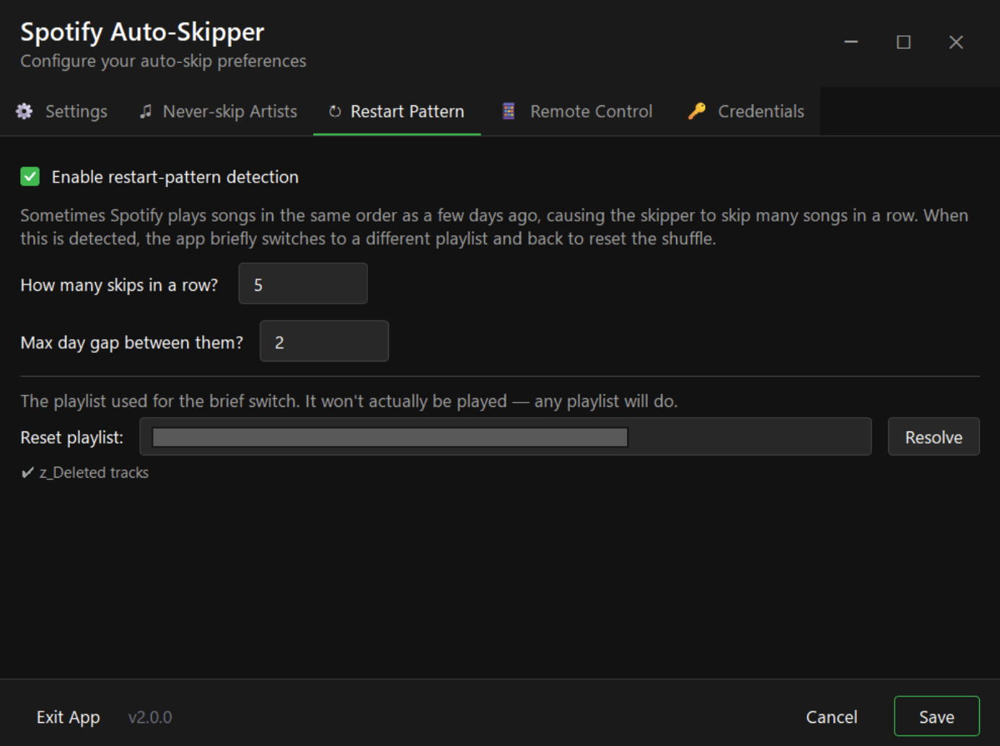

# Spotify + Last.fm Auto-Skipper

A Windows tray app that automatically skips songs on Spotify that you've already listened to recently, based on your Last.fm scrobble history.

## Screenshots

| Settings | Never-skip Artists | Restart Pattern |
|:---:|:---:|:---:|
|  |  |  |

| Remote Control | Credentials |
|:---:|:---:|
|  |  |

---

## Features

- Checks your currently playing Spotify track against Last.fm scrobble history
- Skips songs played within a configurable window (default 60 days)
- **Dark Spotify-themed GUI** built with PySide6
- **Setup wizard** guides you through first-run configuration
- **Settings window** with 3 tabs — accessible from the tray menu
- **Artist search with images** — search Spotify and add artists to the never-skip list
- **Custom app icon** and system tray integration (double-click to open Settings)
- **Encrypted credentials** (Fernet) — secrets never stored in plain text
- **Start with Windows** toggle
- **Never-skip artists** — protect favorite artists from being skipped
- **Always play liked songs** option
- **Playlist restart detection** — breaks repeating skip loops
- **Configurable config/log directories** with Browse pickers
- Logs all activity to daily log files with automatic purge

---

## Getting started

### First run

1. Launch the app (`.exe` or `python -m spotify_auto_skipper`)
2. The **Setup Wizard** opens automatically and walks you through:
   - **Last.fm** credentials (username + API key) with a "Test Connection" button
   - **Spotify** credentials (client ID, secret, refresh token) with a "Test Token" button
   - **Settings** (skip window, poll interval)
3. Click **Finish** and the app starts running in the tray

If you already have a config file, the wizard is skipped.

### Spotify API scopes

When generating your Spotify refresh token, include these scopes:

- `user-read-currently-playing` — detect what's playing
- `user-read-playback-state` — check playback status
- `user-modify-playback-state` — skip tracks
- `user-library-read` — required if you enable "Always play liked songs"
- `user-read-private` — required for artist search

---

## Configuration

Config is stored as JSON in `%APPDATA%\SpotifyAutoSkipper\spotify-auto-skipper-config.json`. Edit it through the **Settings GUI** (right-click the tray icon) or manually.

### Key settings

| Setting | Default | Description |
|---------|---------|-------------|
| `skip_window_days` | 60 | How many days back to check scrobbles |
| `poll_interval_seconds` | 120 | How often to check the current track (min 5s) |
| `always_play_liked_songs` | true | Never skip songs in your Liked Songs library |
| `enable_restart_pattern` | true | Detect and handle playlist restart loops |
| `never_skip_artists` | [] | List of artists (by name + ID) that are never skipped |
| `log_retention_days` | 30 | Auto-delete logs older than this |
| `start_with_windows` | false | Launch the app when Windows starts |

### Sensitive data

The fields `spotify_client_secret`, `spotify_refresh_token`, and `lastfm_api_key` are encrypted automatically using Fernet. The encryption key is stored in `%APPDATA%\SpotifyAutoSkipper\key.bin`.

---

## Running the app

### Option 1: Pre-built EXE

Download `SpotifyAutoSkipper.exe` from the [Releases](https://github.com/Vatroslav/spotify-auto-skipper/releases) page and run it. No installation needed.

### Option 2: Run from source

```
pip install -r requirements.txt
python -m spotify_auto_skipper
```

### Option 3: Build the EXE yourself

```
pip install -r requirements.txt
pip install pyinstaller
python -m PyInstaller SpotifyAutoSkipper.spec --noconfirm
```

The output is `dist/SpotifyAutoSkipper.exe`.

---

## System tray controls

Right-click the tray icon for:

| Menu item | Description |
|-----------|-------------|
| **Pause Skipping** | Pauses all skipping (toggle to resume) |
| **Don't skip this song** | Pauses skipping for the current song only |
| **Check Now** | Immediately checks the current song |
| **Settings...** | Opens the Settings GUI |
| **Open Logs** | Opens the log folder |
| **Exit** | Stops the app |

Double-click the tray icon to open Settings directly.

---

## Logs

Logs are stored in a configurable directory (default: `logs` subfolder next to the app). Each line includes a timestamp. Old logs are automatically purged based on `log_retention_days`.

---

## Tech details

- **GUI** — PySide6 with dark Spotify-inspired theme
- **Spotify API** — current track, skip, playback control, artist search with images
- **Last.fm API** — scrobble history lookup
- **Encryption** — Fernet (from `cryptography`) for credential storage
- **Tray** — `pystray` + `Pillow` for system tray integration

### Project structure

```
spotify_auto_skipper/
  __init__.py              # APP_VERSION
  __main__.py              # Entry point
  app.py                   # Orchestration: mutex, logging, tray, worker thread
  config.py                # JSON config, .ini migration, defaults
  encryption.py            # Fernet encrypt/decrypt for credentials
  spotify_api.py           # Spotify API wrappers
  lastfm_api.py            # Last.fm API wrapper
  tray.py                  # System tray icon and menu
  startup.py               # Windows Registry autostart
  utils.py                 # Shared helpers and state
  gui/
    __init__.py
    theme.py               # Dark Spotify theme (colors, fonts, stylesheets)
    settings_window.py     # Settings GUI (3 tabs)
    setup_wizard.py        # First-run setup wizard
    widgets.py             # ArtistListWidget, search popup
```

### Dependencies

```
requests>=2.28.0
PySide6>=6.5.0
Pillow>=9.0.0
pystray>=0.19.0
cryptography>=41.0.0
```

---

## Credits

Created by [**Vatroslav Mileusnić**](https://www.linkedin.com/in/vatroslavmileusnic) with ChatGPT, Copilot, Claude Code, Figma AI, Canvas AI
